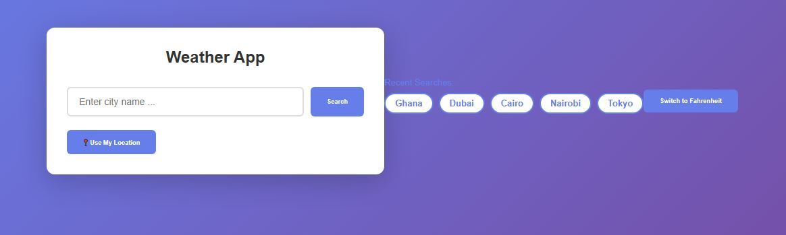
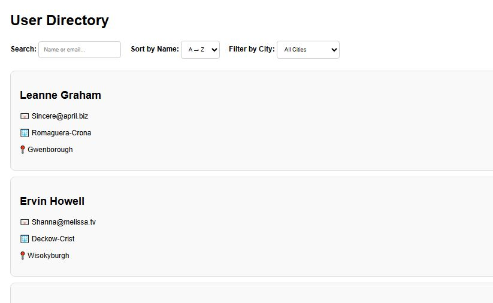

# Week 6: Asynchronous JavaScript

## Author
- **Name:** Connie
- **GitHub:** [@Connie-cloud-svg](https://github.com/Connie-cloud-svg)
- **Date:** April 01, 2026

## Project Description
This week I built a **Weather Dashboard** — a fully functional web app that fetches real-time weather data from the OpenWeatherMap API. The project brought together everything covered in Week 6: Promises, async/await, the Fetch API, error handling, and localStorage. Beyond the mini-project, I worked through lessons on callbacks, Promise chaining, POST requests, and live search/filter on API data.

## Technologies Used
- HTML5
- CSS3
- JavaScript (ES6+)
- OpenWeatherMap API
- Fetch API
- localStorage

## Features
- 🔍 Search weather by city name
- 🌡️ Displays temperature, feels-like, humidity, wind speed & pressure
- 🖼️ Dynamic weather icons from OpenWeatherMap
- ⚠️ Error handling for invalid cities & network failures
- ⏳ Loading state while data is being fetched
- 🕒 Recent Searches — last 5 cities saved to localStorage
- 📅 5-day forecast toggle *(bonus)*
- 🌡️ Celsius / Fahrenheit toggle *(bonus)*
- 📍 Geolocation — auto-detect current location *(bonus)*

## How to Run
1. Clone this repository
2. Open `index.html` in your browser
3. Add your OpenWeatherMap API key in `app.js` where it says `your_api_key_here`

## Tasks Completed

| Task | Topic | Level |
|------|-------|-------|
| Task 11.1 | Synchronous vs Asynchronous & Callback Pattern | 🟢 |
| Task 11.2 | Callback Hell & Introduction to Promises | 🟡 |
| Task 11.3 | Promise Chaining, `Promise.all`, `Promise.race` | 🟡 |
| Task 11.4 | Async/Await & Parallel Fetches | 🔴 |
| Task 12.1 | Fetch API Basics | 🟢 |
| Task 12.2 | Display API Data in DOM | 🟡 |
| Task 12.3 | POST Requests | 🟡 |
| Task 12.4 | Live Search & Filter | 🔴 |

**Daily Challenges:**

| Day | Challenge | Level |
|-----|-----------|-------|
| Day 1 | `delay(ms)` — Promise resolving after N milliseconds | 🟢 |
| Day 2 | Chain 3 Promises with random delays & measure total time | 🟢 |
| Day 3 | Fetch a user — return default object on 404 | 🟡 |
| Day 4 | Rewrite callback code using async/await | 🟡 |
| Day 5 | Parallel fetch from 3 endpoints using `Promise.allSettled()` | 🟡 |

## Lessons Learned
- Async code doesn't run top to bottom — understanding the event loop changed how I think about JavaScript
- Promises are so much cleaner than nested callbacks (callback hell is real!)
- `async/await` makes asynchronous code look and feel synchronous — huge readability win
- Always handle errors with `try/catch` and show the user meaningful feedback
- `Promise.all()` is powerful for parallel requests — much faster than awaiting them one by one

## Challenges Faced
- **Callback Hell** — it was confusing at first to trace deeply nested callbacks; refactoring to Promises made the logic much clearer
- **Fetch error handling** — learned that `fetch()` doesn't throw on 404; you have to check `response.ok` manually
- **localStorage with recent searches** — figuring out how to parse, update, and re-render the history list took a few tries
- **API key security** — understanding that API keys shouldn't be exposed in public repos

## Screenshots 

## Live Demo
[View Live Demo](https://connie-cloud-svg.github.io/iyf-s10-week-06-Connie-cloud-svg)

---

> *"The key to async is trusting the process — just like faith. You send the request, and you wait for the Promise to resolve."* 🌿
